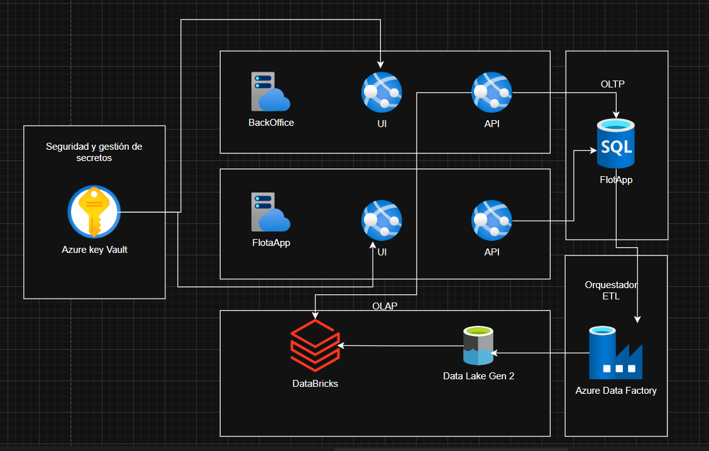
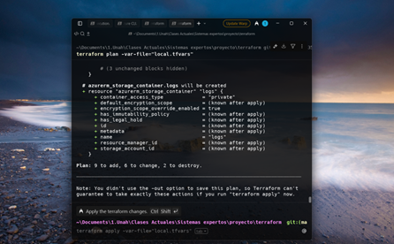
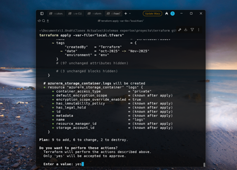
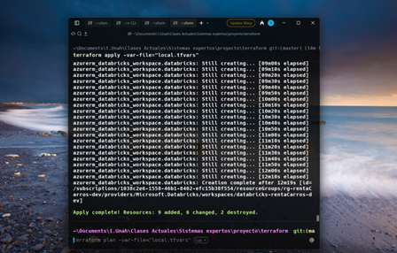
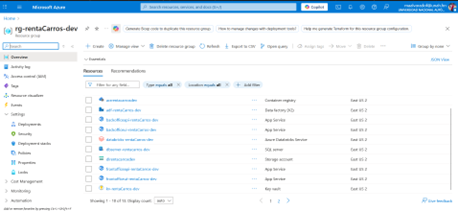

# 🚗 Arquitectura Terraform - Flota de Vehículos Blindados

Proyecto de infraestructura en Azure utilizando Terraform para la gestión de una flota de vehículos blindados con análisis de datos en tiempo real.

## 📖 Descripción del Proyecto

Este proyecto implementa una infraestructura completa en Azure usando Terraform para una empresa de seguridad y logística que lanza una aplicación de renta de vehículos blindados.

---

## 🏗️ Diagrama de Arquitectura



---

## 🎯 Justificación de Servicios

### ❓ Pregunta 1: ¿Qué servicio de BD para el Requisito 1 y por qué?

**Servicio Seleccionado:** Azure SQL Database

Seleccioné Azure SQL Database porque es una base de datos relacional ideal para gestionar reservas, contratos y vehículos con sus relaciones naturales:
- Cliente → Reserva → Contrato → Vehículo

**Ventajas principales:**
- ⚡ Tiempos de respuesta muy rápidos necesarios para operaciones en tiempo real
- 🔒 Alta disponibilidad del 99.99%
- 📦 Sencillo de usar comparado con Cosmos DB o PostgreSQL
- 💪 Rendimiento necesario para miles de transacciones simultáneas

---

### ❓ Pregunta 2: ¿Qué servicio de orquestación para el Requisito 3 y por qué es adecuado para batch ETL?

**Servicio Seleccionado:** Azure Data Factory

Elegí Azure Data Factory porque está diseñado específicamente para mover grandes cantidades de datos de forma programada.

**Características clave:**
- 📅 Programación automática de copias de datos
- 🌙 Ejecución óptima durante horarios de baja actividad
- ⚙️ Paralelización automática del trabajo
- 🔄 Reintentos automáticos ante errores temporales
- 📊 Monitoreo visual de ejecuciones
- 🚨 Alertas automáticas ante fallos
- 🔐 Gestión segura de credenciales mediante Key Vault

**Comparación:** Es más confiable y requiere menos mantenimiento que scripts manuales.

---

### ❓ Pregunta 3: ¿Qué plataforma para el Requisito 4 y por qué es necesaria para telemetría compleja?

**Servicio Seleccionado:** Azure Databricks

Seleccioné Azure Databricks porque es la única plataforma capaz de procesar eficientemente los logs JSON complejos.

**Características clave:**
- 🔥 Apache Spark para análisis distribuido
- 📊 Procesamiento de datos masivos
- 👥 Notebooks colaborativos para analistas
- 🎯 Análisis de patrones de uso y mantenimiento
- 💰 Modelo de pago por uso ($0.44/hora de análisis)
- 🆓 Workspace gratuito cuando está inactivo

**Comparación:** Más flexible que alternativas como Synapse Spark o HDInsight.

## 📸 Evidencia de Despliegue

### 1️⃣ Comprobación de Cambios



En esta captura se realiza la comprobación de los cambios mediante `terraform plan`. Se muestran todos los cambios finales a implementar para la arquitectura desplegada en Azure.

---

### 2️⃣ Ejecución de Apply



Aquí se ejecuta `terraform apply` para desplegar los cambios hacia Azure. La terminal muestra:
- ✅ La orden está formada y lista
- ⏳ Solicita confirmación (respuesta: `yes`)
- 📋 Breve descripción de los cambios
- 🔄 Qué servicios se modificarán y aplicarán

---

### 3️⃣ Confirmación de Éxito



Confirmación desde los servidores de Azure de que los cambios se completaron exitosamente:
- ✅ Estado: **Completado**
- 📊 Tipos de cambios realizados
- ⏱️ **Tiempo total:** 2 minutos 30 segundos (Databricks tardó ~10 minutos)

---

### 4️⃣ Verificación en Azure Portal



Confirmación visual desde la GUI de Azure:
- ✅ Todos los servicios se desplegaron exitosamente
- 📦 Los recursos configurados en Terraform están presentes
- 🏢 La arquitectura completa está operativa en Azure

---

## 💭 Reflexiones Finales

### 🔗 Dependencias en la Infraestructura

En la infraestructura existe una dependencia directa entre el Data Lake y el Key Vault:

**El recurso `azurerm_key_vault_secret.datalake_access_key`** guarda en el Key Vault la clave de acceso de la cuenta de almacenamiento del Data Lake (`azurerm_storage_account.datalake`).

#### Requisitos de creación:

1. **Key Vault** (`azurerm_key_vault.kv`) debe existir antes de poder crear el secreto
2. **Cuenta de almacenamiento** (`azurerm_storage_account.datalake`) también debe existir antes, porque se obtiene su `primary_access_key`

#### Cómo Terraform maneja esto:

Terraform refleja estas dependencias usando:

- **Referencias a otros recursos:** 
  - `azurerm_storage_account.datalake.primary_access_key`
  - `azurerm_key_vault.kv.id`

- **Instrucción explícita:** `depends_on = [azurerm_key_vault.kv]` para asegurar el orden de creación

#### Secuencia de creación implementada:

```
1️⃣ Key Vault se crea completamente
2️⃣ SQL Database se crea
3️⃣ Secretos se almacenan
```

#### 🎓 Lección aprendida:

Aunque Terraform infiere dependencias de variables (`azurerm_key_vault.kv.id`), las operaciones asíncronas de Azure pueden requerir dependencias explícitas para garantizar que el recurso esté "completamente listo".

---

### 📊 Separación OLTP vs OLAP

Separar las cargas OLTP y OLAP en un sistema de alquiler de vehículos es fundamental porque cada tipo de trabajo tiene necesidades muy distintas:

#### Base de datos transaccional (OLTP):

- ⚡ Debe responder en milisegundos
- 🎯 Operaciones críticas: crear reservas, actualizar estado de vehículos, generar contratos
- ⚠️ Cualquier retraso afecta directamente al cliente y al negocio

#### Análisis (OLAP):

- 📈 Consultas pesadas y análisis históricos
- 📊 Análisis de rentabilidad por tipo de vehículo o zona
- 🔍 Patrones de uso y estadísticas de mantenimiento
- 🔄 Muchas agregaciones y joins complejos

#### ⚠️ Problema de mezclarlas:

Si ambas cargas se ejecutan sobre la misma base, las consultas analíticas compiten por:
- CPU
- Memoria
- Disco

Esto genera:
- 🔒 Bloqueos
- ⏱️ Tiempos de espera
- 📉 Degradación general del rendimiento

---

### 🤖 Orquestación vs Scripts Manuales

La diferencia principal entre usar un servicio de orquestación y scripts manuales programados está en:

#### Fiabilidad:

- 🔄 Reintentos automáticos
- 🚨 Manejo de errores integrado
- 📋 Logging automático

#### Trazabilidad:

- 📊 Reportes detallados de cada ejecución
- 🔍 Auditoría completa del proceso
- 📈 Métricas de desempeño

#### Mantenimiento:

- 🛠️ Actualizaciones automáticas
- 📞 Soporte técnico integrado
- 🔐 Seguridad gestionada

#### Funcionalidades de orquestación:

Un servicio de orquestación permite:
- 🔗 Definir pasos encadenados (OLTP → Transformación → OLAP)
- 🎯 Gestionar dependencias entre pasos
- 🔄 Configurar reintentos automáticos ante fallos
- 📊 Generar alertas y reportes detallados


